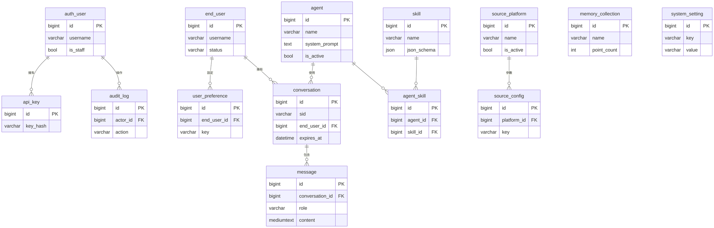

# 社群輿情智能問答 — 完整技術說明

> **一份文件看懂整個系統**：前台問答引擎（tool-calling Agent）＋ 後台管理系統（Django + DRF）＋ 三層記憶與偏好。
> 本檔由 [`README.md`](README.md)（runtime / agent）與 [`docs/admin_backend_spec.md`](docs/admin_backend_spec.md)（後台完整規格）融合的**導覽版**——著重架構與亮點，細節（完整欄位、API）指回 spec。

| 項目 | 內容 |
|---|---|
| 定位 | tool-calling 的**多平台社群口碑問答 Agent** + 可設定化後台 |
| 技術棧 | 前台 runtime：FastAPI · PyMySQL · PyJWT · Qdrant · Azure OpenAI；後台：Django 5 · DRF · MySQL 8；前端：Streamlit |
| 狀態 | M0–M6 + 終端登入 + 使用者長期記憶/登出 + 偏好自動推論 **皆已實作（as-built）**，並通過真實 LLM 端到端驗證 |

---

## 目錄

1. [專案簡介與亮點](#1-專案簡介與亮點)
2. [系統組成（三個服務）與整體架構](#2-系統組成三個服務與整體架構)
3. [Agent 與檢索設計](#3-agent-與檢索設計)
4. [記憶與偏好（四層）](#4-記憶與偏好四層)
5. [後台管理系統（Django + DRF）](#5-後台管理系統django--drf)
6. [專案結構](#6-專案結構)
7. [快速開始](#7-快速開始)
8. [.env 參數](#8-env-參數)
9. [怎麼再加一個平台](#9-怎麼再加一個平台)
10. [開發里程碑（as-built）](#10-開發里程碑as-built)
<!-- 11. [本版不做與關鍵決議](#11-本版不做與關鍵決議) -->

---

## 1. 專案簡介與亮點

tool-calling 的**多平台社群口碑問答 Agent**。借鑑 Hermes Agent「LLM 用 tool calling 自己決定何時呼叫外部工具」的模式，但用既有 Azure OpenAI 技術棧原生實作（不引入 Hermes 平台）。

> 你問「遠距離戀愛可以維持嗎？」→ Agent 判斷需要鄉民口碑 → 呼叫 `community_search` →
> **同時**查 Dcard 口碑庫（向量庫）＋ 即時爬 PTT → 綜合兩邊、帶分平台出處回答。
> 問「一年有幾個月？」→ 判斷不需查 → 直接用常識回答（🟡 黃燈）。

### 面試看點（技術亮點）

- **原生 tool-calling Agent**：不靠框架，LLM 自行規劃是否查、查什麼；`community_search` 一個 skill 對外，內部並行 fan-out 多平台。
- **雙來源混合檢索**：離線向量庫（Dcard）＋ 線上即時爬（PTT），**「兩邊都查」是程式層保證**，不靠 LLM 記得叫兩個工具。
- **Registry + adapter 擴充性**：加平台＝多寫一個 adapter，agent / prompt / loop 全不動。
- **設定資料庫化**：prompt / 模型 / 平台開關 / 檢索門檻全搬進 MySQL，後台改設定**免改程式碼**；runtime 唯讀讀取 + 短 TTL 快取。
- **全域 fail-safe**：任一來源（embed / Qdrant / PTT）或後台 DB 掛掉，只降級不中斷；兩邊都空 → 誠實退回常識（🟡 黃燈），反幻覺。
- **三層記憶 + 偏好自動推論**：對話落地、跨 session 語意記憶、登出時 LLM 從對話**自動學習可執行偏好**（白名單 + 保守門檻 + 不覆寫人工設定）。
- **完整後台**：四模組（agent / 帳戶 / 記憶 / 偏好）、RBAC（admin/editor/viewer）、稽核、JWT 雙身分（操作者 vs 終端使用者）。
- **SQL 優化實績**：N+1 修正（31→2、21→2 查詢）、複合索引消除 filesort、對話列表分頁對齊索引。

---

## 2. 系統組成（三個服務）與整體架構

| 服務 | 埠 | 角色 |
|---|---|---|
| FastAPI runtime（`app/`）| 8001 | 跑 agent、`/ask` 問答、對話落地 MySQL、個人化長期記憶與偏好 |
| Streamlit 聊天前端（`ui/`）| 8501 | 終端使用者問答、🟢/🟡 燈號、登入 / 登出 |
| Django + DRF 後台（`admin_backend/`）| 8000 | 設定 / 帳戶 / 對話管理，**MySQL schema 唯一擁有者** |

```
[Streamlit 聊天 UI]──┐
                     ├──► [FastAPI runtime]  （跑 agent；唯讀 MySQL + Qdrant）
[後台 Web 介面]──────┴──► [Django + DRF]      （寫設定/帳戶/對話；擁有 schema/migration）
                                    │
                          ┌─────────┴─────────┐
                     [MySQL]              [Qdrant]
                  關聯資料：設定、         向量本體：
                  帳戶、對話、metadata     Dcard 口碑庫（唯讀）
```

**架構定案要點：**

1. **共用同一個 MySQL**：Django 寫設定，FastAPI runtime 直接讀同一個 DB。
2. **Schema 唯一擁有者是 Django**：所有表由 Django migration 建立與維護；**FastAPI 用唯讀帳號讀取，絕不建表**。
3. **MySQL 不存向量**：Dcard 口碑庫的向量本體留在 Qdrant；MySQL 只存 metadata / 統計（`memory_collection`）。
4. **帳戶涵蓋兩類人**：後台操作者（staff）+ 終端使用者，兩套身分互不混用。
5. **一鍵起全部**：`.\start.ps1` 同時起 8000/8001/8501（關掉前端會一併收掉另外兩個）。
6. **後台掛掉不影響問答**：runtime 讀不到 DB 時自動 fallback 到 `.env`／寫死預設值照常跑。

---

## 3. Agent 與檢索設計

### 3.1 一個 skill，多個來源 adapter（registry + 並行 fan-out）

對 LLM **只暴露一個工具** `community_search`；底下掛一個**來源 registry**，每個平台是一個 adapter，把該平台包成統一的 `fetch(query) -> list[Post]`。查詢時**並行 fan-out** 到所有 adapter、合併結果（每篇帶 `source` 平台標籤）。

**加新平台＝在 `sources.py` 多寫一個 adapter、加進 `REGISTRY` 即可——agent / loop / prompt 全部不動。** 這也保證「每次兩邊都查」是程式層保證的，不靠 LLM 自己記得同時叫多個工具。

| adapter | 平台 | 方式 | 反爬 |
|---|---|---|---|
| `DcardSource` | Dcard | 查向量庫 `dcard_insight`（語意檢索，唯讀） | 無（離線已建庫） |
| `PttSource` | PTT | 即時爬站內搜尋（時間預算內邊翻邊抓） | 無 Cloudflare，帶 `over18` cookie 即可 |

> Dcard 為何不即時爬：站內搜尋會被 Cloudflare 阻擋，故改查已建好的向量庫。

### 3.2 設計決策

- **Dcard＝向量庫（唯讀）＋多面向檢索**：問句 embedding 後查 `dcard_insight`（3529 筆、1536 維 / Cosine）。先請 LLM 改寫成數條「鄉民用詞」面向查詢（`SEARCH_EXPAND_N`），各查一次後 **round-robin 合併**，避免單一稠密向量被強勢詞綁架；低於門檻（`SEARCH_MIN_SCORE`）視為不夠對題。
- **PTT＝即時爬＋時間預算**：LLM 一次決定（看板 + 多個『單一關鍵詞』）——PTT 多詞是 AND 比對標題（「外型 情緒穩定」→ 0 筆），故抽成多個單詞各搜再合併。翻搜尋頁『邊翻邊抓』，到 `PTT_TIME_BUDGET`（預設 60s）就停；全程禮貌限速避免被 ban。
- **檢索快取＝方案 A（預設）**：查到的社群資料只進**當次 session 記憶體**（`SessionFreshStore`），用完即丟。業務只認 `FreshStore` 抽象。
- **燈號＝來源透明**：有撈到社群討論 → 🟢 綠燈＋標各平台則數＋來源 `[n]`；都沒撈到（或不需查）→ 🟡 黃燈，誠實標為 LLM 既有常識。
- **fail-safe**：任一平台（embed/Qdrant/PTT）失敗只少那一邊，不影響其他來源；兩邊都空就退回常識回答。
- **工具＝skill**：`tools.py` 的 `description` 寫清楚「何時該用」＝觸發條件，等同 Hermes skill 的 trigger。

---

## 4. 記憶與偏好（四層）

| 層 | 存哪 | 存什麼 | 生命週期 |
|---|---|---|---|
| 檢索快取（方案 A）| 程序記憶體 `SessionFreshStore` | 當次查到的社群貼文 | 當次 session，用完即丟 |
| 對話紀錄 | 後台 MySQL `conversation` / `message` | 每輪 Q/A（`memory_store.persist_turn`）| 落地保存、可在後台檢視；登出軟刪 |
| 使用者長期記憶 | Qdrant `user_memory` collection | LLM 萃取的「關於使用者本人的長期事實」（`user_memory.py`）| 跨 session 保留，**僅登入者** |
| 使用者偏好（自動推論）| 後台 MySQL `user_preference` | LLM 從對話萃取的「可執行設定旋鈕」：語氣/長度/語言/平台過濾（`user_preference.py`）| 登出時推論寫入、跨 session；依優先序套用，**僅登入者** |

- **記憶 vs 偏好**：`user_memory`（Qdrant）記「描述性」自由文字事實、語意召回個人化**內容**；`user_preference`（MySQL）記「指令性」設定旋鈕、runtime 用精確 key **確定性改變行為**。兩者寫入路徑獨立。
- **偏好推論比記憶保守**（因為會確定性且靜默地改變行為，例如誤設 `excluded_platforms` 會默默關掉資料源）：只收白名單 key、值域受限、過信心門檻（`PREF_INFER_MIN_CONFIDENCE`，預設 0.75），且 `source='manual'` 的人工設定**永不被覆寫**。
- **取值優先序**（runtime 解析）：`user_preference` > `agent` > `system_setting`。
- **只有登入使用者**才有長期記憶與對話歸戶；匿名照常能問答但不留記憶。全程 fail-safe：記憶那層炸掉也不影響回答。

**登入 / 登出流程（as-built）**：Streamlit 向 Django `end-auth` 拿 JWT（共用 `TOKEN_SECRET`、HS256），聊天帶 `Authorization: Bearer`；runtime 驗證取 `end_user_id`（失敗即匿名）。**登出**（`POST /logout`）把整段對話 ①摘要成長期事實寫入 `user_memory`、②推論可執行偏好寫入 `user_preference`、③軟刪原始對話，回 `{ok, summarized, inferred, deleted_rows}`。

> 詳細機制（每輪萃取、meta 問題列表、payload 備查、四道護欄）見 [`admin_backend_spec.md` §8.1–8.3](docs/admin_backend_spec.md#81-終端登入與-token-驗證as-built)。

---

## 5. 後台管理系統（Django + DRF）

### 5.1 四模組總覽與邊界

| 模組 | Django app | 職責 | 取代原本哪段死碼 |
|---|---|---|---|
| 一、Skill / Agent | `agents` | agent 人設/模型/參數、skill 定義、來源平台與其參數 | `agent.py` 常數、`tools.py` TOOLS、`sources.py` REGISTRY |
| 二、帳戶 | `accounts` | 操作者 RBAC、終端使用者、API 金鑰、稽核 | （原本完全沒有） |
| 三、記憶 | `memory` | 對話落地 MySQL、檢視 Qdrant 口碑庫 metadata | `ui/.sessions/*.json`、`store.py`（部分） |
| 四、偏好 | `preferences` | 全域系統設定（取代 `.env`）、per-user 偏好 | `config.py` settings |

- **模組一 = 結構**（有哪些 agent / skill / 平台、各自功能參數）；**模組四 = 偏好層**（全域預設 + 每使用者覆寫）。
- **runtime 取值優先序**：`user_preference` > `agent` 設定 > `system_setting` 全域預設。

### 5.2 資料模型 ERD



**關聯機制（FK 存 PK）**：`audit_log.actor_id`/`api_key.owner_user_id`→`auth_user`、`conversation.end_user_id`→`end_user`、`conversation.agent_id`→`agent`、`message.conversation_id`→`conversation`、`user_preference.end_user_id`→`end_user`、`source_config.platform_id`→`source_platform`；`agent ↔ skill` 為多對多，透過中間表 `agent_skill`。`memory_collection`、`system_setting` 為全域層級、刻意不連 FK。

### 5.3 資料表一覽（14 張；完整欄位型別/限制見 [spec §6](docs/admin_backend_spec.md#6-資料表欄位定義)）

| 模組 | 表 | 職責重點 |
|---|---|---|
| 帳戶 | `auth_user`（Django 內建）| 後台操作者 + RBAC（用 Group） |
| 帳戶 | `end_user` | 終端使用者（帳密 / SSO 欄位、狀態） |
| 帳戶 | `api_key` | runtime/外部呼叫金鑰（只存 hash） |
| 帳戶 | `audit_log` | 後台寫入稽核（actor / action / before-after diff） |
| Agent | `agent` | 人設 prompt / model / temperature / max_tool_rounds（`is_active` 唯一啟用） |
| Agent | `skill` | function-calling schema + 給 LLM 的觸發條件 |
| Agent | `agent_skill` | agent ↔ skill 多對多中間表 |
| Agent | `source_platform` | 來源平台（adapter_key / kind / 啟用開關 / 順序） |
| Agent | `source_config` | 每平台參數 key-value（top_k / min_score / expand_n…） |
| 記憶 | `conversation` | 對話（sid / 歸戶 / 軟刪；`conv_list_idx` 複合索引對齊列表查詢） |
| 記憶 | `message` | 每則訊息（role / content / used_tools / sources JSON） |
| 記憶 | `memory_collection` | Qdrant collection metadata（point_count / status，檢視用） |
| 偏好 | `system_setting` | 全域業務設定 key-value（取代 `.env`） |
| 偏好 | `user_preference` | 每使用者偏好；含 `source`(manual/inferred) + `confidence`，manual 不被推論覆寫 |

### 5.4 DRF API（完整方法/路徑/權限見 [spec §7](docs/admin_backend_spec.md#7-drf-api-endpoint-清單)）

- Base path `/api/v1/`；**runtime 不走 API、直接讀 DB**。權限分 `admin` / `editor` / `viewer`。
- **認證（雙身分）**：`/auth/*` 給後台操作者（Django `auth_user`）、`/end-auth/*` 給終端使用者（`end_user`，回 JWT 供 Streamlit），兩套互不混用。
- **四模組 CRUD**：
  - Agent：`/agents/`（+`activate`、`test-run`）、`/skills/`、`/source-platforms/`（+`configs`）
  - 帳戶：`/operators/`、`/end-users/`（+`disable`）、`/api-keys/`、`/audit-logs/`
  - 記憶：`/conversations/`（列表分頁、`messages`、`export`、`purge`）、`/memory-collections/`（+`sync`）
  - 偏好：`/system-settings/`、`/end-users/{id}/preferences/`

### 5.5 Runtime 整合：FastAPI 如何讀 MySQL

新增一層 **`ConfigRepository`**：唯讀帳號讀設定 + 程序內快取（30–60 秒 TTL）或 `/internal/reload-config` 顯式重載，避免每個 request 查 DB。原本寫死的東西改讀自 DB：

| 原本的死碼 | 改讀自 |
|---|---|
| `agent.py` `SYSTEM_PROMPT` / `MAX_TOOL_ROUNDS` | `agent`（`is_active=1`） |
| `tools.py` `TOOLS` | `skill` + `agent_skill` |
| `sources.py` `REGISTRY` 啟用與順序 | `source_platform` |
| 各檢索參數（top_k / min_score / expand_n / PTT 預算） | `source_config` |
| `config.py` 業務設定（model / 門檻 / 逾時） | `system_setting` |
| 每使用者語氣 / 平台過濾 / 答案長度 | `user_preference` |

> **`.env` 仍保留**啟動前需要且機密的東西：MySQL 連線、LLM API Key、Qdrant URL、記憶/偏好開關。**業務設定才搬進 `system_setting`。**

### 5.6 權限與 DB 帳號（最小權限）

**RBAC（Django Group）**：`admin`（全部）、`editor`（agent/skill/source/setting CRUD + 終端使用者 + 記憶管理，不碰操作者/金鑰）、`viewer`（全唯讀）。後台寫入一律記 `audit_log`。

**DB 帳號**：`root`（Django 管 schema、寫 `end_user`）、`crawl_ro`（runtime 唯讀讀設定/偏好）、`crawl_rw`（runtime 寫 `conversation`/`message`；**偏好自動推論**另需 `user_preference` 的 **SELECT/INSERT/UPDATE**——SELECT 是因 upsert 守衛 `IF(source='manual', …)` 要讀既有 `source` 欄）：

```sql
GRANT SELECT, INSERT, UPDATE ON <db>.conversation     TO 'crawl_rw'@'<host>';
GRANT SELECT, INSERT, UPDATE ON <db>.message          TO 'crawl_rw'@'<host>';
GRANT SELECT, INSERT, UPDATE ON <db>.user_preference  TO 'crawl_rw'@'<host>';
```

> 資料遷移/初始 seed（system_setting / source_platform / agent / skill / memory_collection / 對話遷移）見 [spec §9](docs/admin_backend_spec.md#9-資料遷移與初始化)。

---

## 6. 專案結構

```
SEIQA/
├─ app/                     # FastAPI runtime（agent + 唯讀 MySQL 讀取層）
│   config.py               # .env 設定（LLM / Qdrant / 口碑庫 / PTT / MySQL / 記憶 / 偏好）
│   llm.py                  # LLM 客戶端：chat() / chat_with_tools() / embed() / expand_queries()
│   vectorstore.py          # Dcard 口碑庫向量檢索（Qdrant REST，多面向 + 門檻）
│   ptt.py                  # PTT 即時爬蟲（requests + bs4，over18 + 時間預算 + 限速 + 重試）
│   sources.py              # 來源 registry：Source 抽象 + DcardSource/PttSource + 並行 fan-out
│   store.py                # FreshStore 抽象 + SessionFreshStore(A) + QdrantHotStore(B 預留)
│   tools.py                # 單一 skill：community_search
│   agent.py                # 規劃→工具→行動 的多輪 loop
│   config_repo.py          # ConfigRepository：唯讀讀後台 MySQL 設定（短 TTL 快取 + reload）
│   memory_store.py         # 每輪對話落地 MySQL（crawl_rw 帳號，fail-safe）
│   user_memory.py          # 使用者長期語意記憶（Qdrant：萃取事實 → 注入 prompt）
│   user_preference.py      # 使用者偏好自動推論（登出時萃取設定旋鈕 → MySQL user_preference）
│   auth.py                 # 驗證 Django 簽發的終端 token → end_user_id（失敗即匿名）
│   api.py                  # FastAPI：/ask、/logout、/health、/internal/reload-config
├─ ui/streamlit_app.py      # 聊天前端（🟢/🟡 燈號 + 來源分組 + 登入/登出）
├─ admin_backend/           # Django + DRF 後台（accounts / agents / memory / preferences）
├─ docs/admin_backend_spec.md   # 後台完整規格（本檔的來源之一）
├─ .venv/ /.venv-admin/     # runtime 環境 / Django 後台環境
└─ start.ps1                # 一鍵起 Django(8000) + FastAPI(8001) + Streamlit(8501)
```

---

## 7. 快速開始

**前置**：Qdrant 跑著、`dcard_insight` 已有資料、`EMBED_MODEL` 與建庫時同一模型（`text-embedding-3-small`，1536 維）；PTT 免設定。

**只跑問答 runtime（最小；不需 MySQL / 後台）**

```powershell
python -m venv .venv; .venv\Scripts\activate
pip install -r requirements.txt
# 建立 .env（無範本檔），至少填 LLM_API_KEY / Azure endpoint / QDRANT_URL
uvicorn app.api:app --reload --port 8001
```

> `DB_HOST` 留空＝停用後台整合，runtime 全走 `.env`／預設值。

**完整系統（後台 + runtime + 前端，一鍵）**

```powershell
python -m venv .venv-admin
.venv-admin\Scripts\pip install -r requirements-admin.txt
.venv-admin\Scripts\python admin_backend\manage.py migrate
.\start.ps1                                                  # Django 8000 + FastAPI 8001 + Streamlit 8501
```

**測試**：Swagger UI（http://localhost:8001/docs）／ curl `POST /ask` ／ Streamlit 前端。回覆上方標「🟢 Dcard X 則 / PTT Y 則」或「🟡 LLM 既有常識」。含 PTT 即時爬時一題最久 ≈ `PTT_TIME_BUDGET` 秒。

---

## 8. .env 參數

```
EMBED_MODEL=text-embedding-3-small   # 須與建 dcard_insight 時同一個模型
QDRANT_URL=http://localhost:7333
INSIGHT_COLLECTION=dcard_insight     # Dcard 口碑庫 collection
SEARCH_TOP_K=5 / SEARCH_EXPAND_N=3 / SEARCH_MIN_SCORE=0.5   # Dcard 檢索：則數 / 改寫條數 / 門檻
PTT_TIME_BUDGET=60                   # PTT 即時爬時間預算（秒）
PTT_MIN_DELAY=0.5 / PTT_MAX_DELAY=1.0  # PTT 禮貌限速

# --- 個人化長期記憶（僅登入者；fail-safe）---
USER_MEMORY_ENABLED=true / USER_MEMORY_COLLECTION=user_memory
USER_MEMORY_TOP_K=3 / USER_MEMORY_MIN_SCORE=0.35            # 撈回條數 / 召回門檻

# --- 使用者偏好自動推論（登出時萃取設定旋鈕 → user_preference；比長期記憶保守）---
PREF_INFER_ENABLED=true              # 關掉即不自動推論偏好
PREF_INFER_MIN_CONFIDENCE=0.75       # 只有信心 >= 此值才寫入（越高越保守）

# --- 後台 MySQL 整合（DB_HOST 留空＝停用整合，只跑 runtime）---
DB_HOST=127.0.0.1 / DB_NAME=crawl_agent
DB_USER=crawl_ro   / DB_PASSWORD=...      # 唯讀帳號（讀設定 / 偏好）
DB_RW_USER=crawl_rw / DB_RW_PASSWORD=...  # 讀寫帳號（寫 conversation / message / user_preference）
CONFIG_CACHE_TTL=30                  # runtime 設定快取秒數
TOKEN_SECRET=...                     # 與 admin_backend/.env 同值：驗證終端登入 token
```

---

## 9. 怎麼再加一個平台（如 Mobile01 / 巴哈 / LIHKG）

1. 寫一個 adapter：在 `sources.py` 新增 `Source` 子類，實作 `fetch(query) -> list[Post]`（Post 標 `source="平台名"`）。
2. 加進 `REGISTRY`（或在後台 `source_platform` 開一筆，設 `adapter_key`、`is_active`）。
3. （前端可選）在 UI 的來源分組加該平台標籤。

agent / tools / prompt 都不用動——這就是 registry 的用意。

---

## 10. 開發里程碑（as-built）

| 里程碑 | 內容 |
|---|---|
| M0–M2 | Django 骨架 + MySQL；模組二 auth/RBAC；模組一 agent/skill/source CRUD + seed |
| M3 | FastAPI 讀取層（`ConfigRepository`）+ 快取 → runtime 吃 DB 設定 |
| M4–M5 | 模組三對話落地 + 檢視 API；模組四 system_setting + user_preference + 取值優先序 |
| M6 | 後台前端（先用 Django Admin / DRF browsable API） |
| 追加 | 終端登入（Django 發 token / runtime 驗）、使用者長期記憶、登出摘要、**偏好自動推論** |

> ✅ **as-built**：全部完成並通過真實 LLM 端到端驗證（後台改 prompt→reload→回答變、`community_search` 雙來源、對話落地、登入後偏好過濾平台 + 對話歸戶、登出摘要與偏好推論）。

---

<!-- ## 11. 本版不做與關鍵決議 -->

<!-- **Out of Scope**：方案 B「越用越強」累積記憶（`QdrantHotStore` 預留）、從後台重建 Qdrant 向量庫、多租戶、新平台 adapter 實作（schema 已預留）。 -->

<!-- **關鍵決議**：① 終端登入用自管帳密（SSO 為 drop-in）；② 對話歷史收斂到 DB 單一真相（先只寫、後改讀，避免雙真相漂移）；③ 設定生效用短 TTL 快取 + 重載端點；④ 後台前端先用 Django Admin 過渡、DRF API 同步建；⑤ 入口 Django 8000 + Streamlit 側邊欄連結。 -->

> 完整規格（欄位、API、決議脈絡）見 [`docs/admin_backend_spec.md`](docs/admin_backend_spec.md)。
