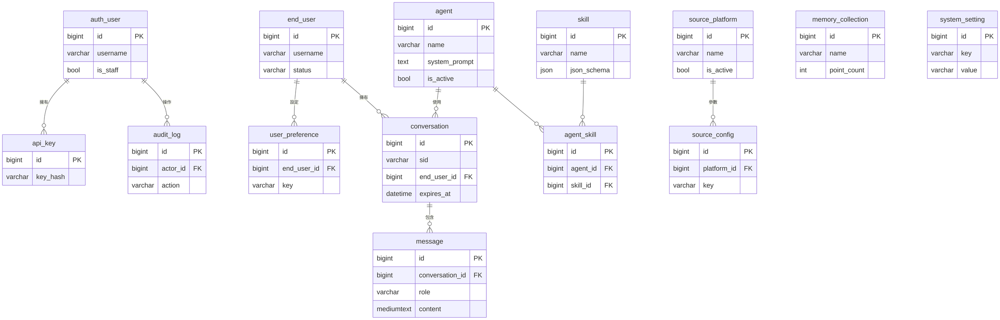

# 社群輿情智能問答 後台管理系統 — 規格書（開發藍圖）

| 項目 | 內容 |
|---|---|
| 文件版本 | v0.4（M0–M6 + 終端登入 + 使用者長期記憶/登出 已實作；以下含 as-built 註記） |
| 建立日期 | 2026-06-26（v0.3 更新：2026-06-27；v0.4 更新：2026-07-01） |
| 技術棧 | 後台：Django + DRF + MySQL；runtime：FastAPI + PyMySQL + PyJWT + Qdrant |

---

## 0. 目錄

1. [背景與目標](#1-背景與目標)
2. [架構總覽（定案）](#2-架構總覽定案)
3. [專案結構與技術棧](#3-專案結構與技術棧)
4. [四模組總覽與邊界](#4-四模組總覽與邊界)
5. [資料模型 ERD](#5-資料模型-erd)
6. [資料表欄位定義](#6-資料表欄位定義)
7. [DRF API Endpoint 清單](#7-drf-api-endpoint-清單)
8. [Runtime 整合（FastAPI 如何讀 MySQL）](#8-runtime-整合fastapi-如何讀-mysql)
9. [資料遷移與初始化](#9-資料遷移與初始化)
10. [權限 / RBAC 設計](#10-權限--rbac-設計)
11. [非功能性需求與注意事項](#11-非功能性需求與注意事項)
12. [開發里程碑](#12-開發里程碑)
13. [本版不做（Out of Scope）](#13-本版不做out-of-scope)
14. [決議事項](#14-決議事項)

---

## 1. 背景與目標

現有系統「社群輿情智能問答」由兩個既有元件組成：

- **FastAPI runtime**（`app/`）：跑 agent loop，呼叫 `community_search` skill，並行 fan-out 到 Dcard 口碑庫（Qdrant 向量檢索）與即時爬 PTT，綜合回答。
- **Streamlit 聊天 UI**（`ui/`）：給終端使用者問答，對話以 JSON 檔存在 `ui/.sessions/`。


---

## 2. 架構總覽（定案）

```
[Streamlit 聊天 UI]──┐
                     ├──► [FastAPI runtime]  （跑 agent；唯讀 MySQL + Qdrant）
[後台 Web 介面]──────┴──► [Django + DRF]      （寫設定/帳戶/對話；擁有 schema/migration）
                                    │
                          ┌─────────┴─────────┐
                     [MySQL]              [Qdrant]
                  關聯資料：設定、         向量本體：
                  帳戶、對話、metadata     Dcard 口碑庫（唯讀）
```

**定案要點：**

1. **共用同一個 MySQL**：Django 寫設定，FastAPI runtime 直接讀同一個 DB。
2. **Schema 唯一擁有者是 Django**：所有表由 Django migration 建立與維護；**FastAPI 用唯讀帳號讀取，絕不建表**，避免兩邊打架。
3. **MySQL 不存向量**：Dcard 口碑庫的向量本體留在 Qdrant；MySQL 只存它的 metadata / 統計（`memory_collection`）。
4. **帳戶涵蓋兩類人**：後台操作者（staff）+ 終端使用者（問問題的人）。
5. **全域設定獨立歸「偏好設定」模組**；「skill agent」模組只管 agent / skill / 來源的結構與功能參數。

---

## 3. 專案結構與技術棧

**同一個 repo、後台獨立子資料夾、獨立 venv。**

```
SEIQA/
├─ app/                 # 既有 FastAPI runtime（將新增唯讀 MySQL 讀取層）
├─ ui/                  # 既有 Streamlit 聊天（終端使用者）
├─ admin_backend/       # 【新增】Django + DRF（MySQL schema 擁有者）
│   ├─ manage.py
│   ├─ config/          # Django settings / urls / wsgi
│   ├─ accounts/        # 模組二：帳戶
│   ├─ agents/          # 模組一：skill / agent
│   ├─ memory/          # 模組三：記憶
│   └─ preferences/     # 模組四：偏好 / 全域設定
├─ docs/
│   └─ admin_backend_spec.md   # 本文件
├─ .venv/               # 既有（fastapi / streamlit / openai / qdrant…）
├─ .venv-admin/         # 【新增】（django / djangorestframework / mysqlclient）
└─ requirements-admin.txt
```

| 層 | 選型 | 備註 |
|---|---|---|
| Web framework | Django 5.x | 內建 Admin、Auth、ORM、migration |
| API | Django REST Framework | ViewSet + Router + Serializer |
| 後台認證 | JWT（`djangorestframework-simplejwt`） | 操作者登入 |
| DB driver | `mysqlclient`（或 `PyMySQL`） | MySQL 8.x |
| 字元集 | `utf8mb4` / `utf8mb4_unicode_ci` | **必要**：中文 + emoji（🕷️）|
| runtime 讀取層 | SQLAlchemy Core 或 PyMySQL（FastAPI 端） | 唯讀帳號 + 程序內快取 |

---

## 4. 四模組總覽與邊界

| 模組 | Django app | 職責 | 取代現在哪段死碼 |
|---|---|---|---|
| 一、Skill / Agent | `agents` | agent 人設/模型/參數、skill 定義、來源平台與其參數 | `agent.py` 常數、`tools.py` TOOLS、`sources.py` REGISTRY |
| 二、帳戶 | `accounts` | 操作者 RBAC、終端使用者、API 金鑰、稽核 | （目前完全沒有） |
| 三、記憶 | `memory` | 對話落地 MySQL、檢視 Qdrant 口碑庫 metadata | `ui/.sessions/*.json`、`store.py`（部分） |
| 四、偏好 | `preferences` | 全域系統設定（取代 `.env`）、per-user 偏好 | `config.py` settings |

**模組一 vs 模組四的邊界（避免重複）：**

- **模組一 = 結構**：有哪些 agent / skill / 平台、各自的功能參數（top_k、門檻…）。
- **模組四 = 偏好層**：全域預設值 + 每使用者覆寫。
- **runtime 取值優先序：`user_preference` > `agent` 設定 > `system_setting` 全域預設`**。

> 範例：回答用的模型 → 先看該使用者 `user_preference.model`，沒有就用 `agent.model`，再沒有才用 `system_setting['chat_model']`。

---

## 5. 資料模型 ERD



---

## 6. 資料表欄位定義

> 慣例：所有表皆有隱含 `id BIGINT PK AUTO_INCREMENT`（Django 預設）。型別為 MySQL 型別。所有 `*_at` 為 `DATETIME`。字元集統一 `utf8mb4`。

### 6.1 模組二：帳戶（`accounts`）

**操作者**直接用 Django 內建 `auth_user` / `auth_group` / `auth_permission`（不另建表，RBAC 用 Group）。以下為自訂表：

#### `end_user`（終端使用者）
| 欄位 | 型別 | 限制 / 說明 |
|---|---|---|
| username | VARCHAR(64) | UNIQUE，登入帳號 / 識別 |
| display_name | VARCHAR(128) | 顯示名稱 |
| email | VARCHAR(254) | NULL，UNIQUE |
| password_hash | VARCHAR(255) | NULL（外部 SSO 時為空） |
| auth_provider | VARCHAR(32) | DEFAULT 'local'（local / google / …） |
| status | VARCHAR(16) | DEFAULT 'active'（active / disabled） |
| created_at | DATETIME | |
| updated_at | DATETIME | |
| last_login_at | DATETIME | NULL |

#### `api_key`（選用：runtime / 外部 client 呼叫）
| 欄位 | 型別 | 限制 / 說明 |
|---|---|---|
| name | VARCHAR(64) | 用途說明 |
| key_hash | VARCHAR(255) | 只存 hash，不存明碼 |
| prefix | VARCHAR(12) | 顯示用前綴 |
| owner_user_id | BIGINT FK→auth_user.id | NULL |
| scopes | JSON | 權限範圍 |
| is_active | BOOL | DEFAULT 1 |
| created_at | DATETIME | |
| expires_at | DATETIME | NULL |
| last_used_at | DATETIME | NULL |

#### `audit_log`（後台寫入稽核）
| 欄位 | 型別 | 限制 / 說明 |
|---|---|---|
| actor_id | BIGINT FK→auth_user.id | NULL |
| action | VARCHAR(32) | create / update / delete / publish |
| target_type | VARCHAR(64) | 'agent' / 'skill' / 'system_setting' … |
| target_id | VARCHAR(64) | 目標主鍵 |
| changes | JSON | before / after diff |
| ip | VARCHAR(45) | NULL |
| created_at | DATETIME | INDEX(created_at) |

### 6.2 模組一：Skill / Agent（`agents`）

#### `agent`
| 欄位 | 型別 | 限制 / 說明 |
|---|---|---|
| name | VARCHAR(64) | UNIQUE |
| description | VARCHAR(255) | NULL |
| system_prompt | TEXT | 取代 `agent.py` 的 `SYSTEM_PROMPT` |
| model | VARCHAR(64) | 例：gpt-4.1 |
| temperature | DECIMAL(3,2) | DEFAULT 0.70 |
| max_tool_rounds | SMALLINT | DEFAULT 1，取代 `MAX_TOOL_ROUNDS` |
| is_active | BOOL | DEFAULT 0；全系統同時只有 1 個啟用 |
| version | INT | DEFAULT 1 |
| created_by | BIGINT FK→auth_user.id | NULL |
| created_at / updated_at | DATETIME | |

> **（選用，Phase 2）`agent_revision`**：保存 prompt / 參數的歷史快照，支援版本回溯與發布。欄位＝`agent_id FK`、`version`、`system_prompt`、`model`、`temperature`、`max_tool_rounds`、`note`、`created_by`、`created_at`，`UNIQUE(agent_id, version)`。

#### `skill`
| 欄位 | 型別 | 限制 / 說明 |
|---|---|---|
| name | VARCHAR(64) | UNIQUE，例：community_search |
| display_name | VARCHAR(128) | |
| description | TEXT | 給 LLM 的「何時該用」觸發條件 |
| json_schema | JSON | function-calling parameters schema |
| handler_key | VARCHAR(64) | runtime `dispatch` 對應的內部 key |
| is_active | BOOL | DEFAULT 1 |
| created_at / updated_at | DATETIME | |

#### `agent_skill`（多對多）
| 欄位 | 型別 | 限制 / 說明 |
|---|---|---|
| agent_id | BIGINT FK→agent.id | |
| skill_id | BIGINT FK→skill.id | |
| sort_order | SMALLINT | DEFAULT 0 |
| | | UNIQUE(agent_id, skill_id) |

#### `source_platform`（對應 `sources.py` REGISTRY）
| 欄位 | 型別 | 限制 / 說明 |
|---|---|---|
| name | VARCHAR(32) | UNIQUE，例：dcard / ptt / mobile01 |
| display_name | VARCHAR(64) | 例：Dcard 口碑庫 / PTT |
| adapter_key | VARCHAR(64) | 對應 runtime adapter |
| kind | VARCHAR(16) | 'vector' / 'live_crawl' |
| is_active | BOOL | DEFAULT 1（開關此平台） |
| sort_order | SMALLINT | DEFAULT 0（合併順序） |
| created_at / updated_at | DATETIME | |

#### `source_config`（每平台參數，key-value typed）
| 欄位 | 型別 | 限制 / 說明 |
|---|---|---|
| platform_id | BIGINT FK→source_platform.id | |
| key | VARCHAR(64) | top_k / min_score / expand_n / time_budget / min_delay / max_delay |
| value | VARCHAR(255) | |
| value_type | VARCHAR(16) | int / float / str / bool |
| | | UNIQUE(platform_id, key) |

### 6.3 模組三：記憶（`memory`）

#### `conversation`
| 欄位 | 型別 | 限制 / 說明 |
|---|---|---|
| sid | VARCHAR(32) | UNIQUE，對應 Streamlit 的 sid |
| end_user_id | BIGINT FK→end_user.id | NULL（匿名） |
| agent_id | BIGINT FK→agent.id | NULL |
| title | VARCHAR(255) | NULL（可由首句自動產生） |
| message_count | INT | DEFAULT 0 |
| created_at / updated_at | DATETIME | |
| last_active_at | DATETIME | 列表排序鍵（由 `conv_list_idx` 涵蓋，見下） |
| expires_at | DATETIME | NULL，TTL；過期可清，INDEX |
| is_deleted | BOOL | DEFAULT 0（軟刪） |
| | | INDEX(end_user_id) |
| | | INDEX `conv_list_idx`(is_deleted, last_active_at↓, created_at↓) — 對齊「濾軟刪＋時間倒序＋分頁」列表查詢，免 filesort／全表掃描（量測見根目錄 `優化sql查詢.txt`） |

#### `message`
| 欄位 | 型別 | 限制 / 說明 |
|---|---|---|
| conversation_id | BIGINT FK→conversation.id | |
| role | VARCHAR(16) | user / assistant / system / tool |
| content | MEDIUMTEXT | |
| used_tools | JSON | NULL，例：["community_search"] |
| sources | JSON | NULL，例：[{title,url,source,created_at}] |
| token_usage | JSON | NULL（選用） |
| created_at | DATETIME | INDEX(conversation_id, created_at) |

#### `memory_collection`（Qdrant metadata，檢視用）
| 欄位 | 型別 | 限制 / 說明 |
|---|---|---|
| name | VARCHAR(64) | UNIQUE，Qdrant collection 名（dcard_insight） |
| display_name | VARCHAR(128) | |
| kind | VARCHAR(16) | 'dcard' / 'hot'（hot 為預留，本版不啟用） |
| is_readonly | BOOL | DEFAULT 1 |
| point_count | INT | NULL，後台同步來的快照 |
| vector_size | INT | NULL（例：1536） |
| status | VARCHAR(16) | NULL（green / red / unknown） |
| last_synced_at | DATETIME | NULL |
| note | VARCHAR(255) | NULL |

### 6.4 模組四：偏好（`preferences`）

#### `system_setting`（取代 `.env` 的業務設定）
| 欄位 | 型別 | 限制 / 說明 |
|---|---|---|
| key | VARCHAR(64) | UNIQUE，例：chat_model / search_min_score / crawl_timeout |
| value | VARCHAR(512) | |
| value_type | VARCHAR(16) | int / float / str / bool / json |
| group | VARCHAR(32) | llm / retrieval / crawler / ptt / general |
| description | VARCHAR(255) | NULL |
| is_secret | BOOL | DEFAULT 0（顯示時遮罩） |
| updated_by | BIGINT FK→auth_user.id | NULL |
| updated_at | DATETIME | |

#### `user_preference`（每使用者覆寫）
| 欄位 | 型別 | 限制 / 說明 |
|---|---|---|
| end_user_id | BIGINT FK→end_user.id | |
| key | VARCHAR(64) | tone / answer_length / language / included_platforms / excluded_platforms |
| value | VARCHAR(512) | |
| value_type | VARCHAR(16) | int / float / str / bool / json |
| updated_at | DATETIME | |
| | | UNIQUE(end_user_id, key) |

---

## 7. DRF API Endpoint 清單

- Base path：`/api/v1/`
- 後台 API 僅供**後台前端**使用；**runtime 不走 API，直接讀 DB**（見 §8）。
- 權限：`admin` / `editor` / `viewer`（見 §10）；`public*` 表示供 Streamlit 終端登入用。

### 7.1 認證
| 方法 | 路徑 | 用途 | 權限 |
|---|---|---|---|
| POST | `/api/v1/auth/login/` | 操作者登入，回 JWT | public |
| POST | `/api/v1/auth/refresh/` | 換新 access token | public |
| POST | `/api/v1/auth/logout/` | 登出（黑名單 refresh） | 登入者 |
| POST | `/api/v1/end-auth/register/` | 終端使用者自助註冊，**回 JWT**（註冊即登入） | public* |
| POST | `/api/v1/end-auth/login/` | 終端使用者登入，**回 JWT**（供 Streamlit） | public* |

> ✅ **as-built**：`/auth/*` 給**操作者**（Django `auth_user`）、`/end-auth/*` 給**終端使用者**（`end_user` 表），兩套身分互不混用。終端 JWT 以共用 `TOKEN_SECRET`（HS256、7 天）簽發；runtime `/ask` 以 `Authorization: Bearer <token>` 驗證後取得 `end_user_id`（流程見 §8.1）。

### 7.2 模組一：Skill / Agent（`agents`）
| 方法 | 路徑 | 用途 | 權限 |
|---|---|---|---|
| GET / POST | `/api/v1/agents/` | 列表 / 新增 agent | viewer / editor |
| GET / PUT / PATCH / DELETE | `/api/v1/agents/{id}/` | 單筆讀寫刪 | viewer / editor |
| POST | `/api/v1/agents/{id}/activate/` | 設為目前啟用的 agent | editor |
| POST | `/api/v1/agents/{id}/test-run/` | 試跑：帶測試問句打 runtime 看效果 | editor |
| GET / POST | `/api/v1/skills/` | skill 列表 / 新增 | viewer / editor |
| GET / PUT / PATCH / DELETE | `/api/v1/skills/{id}/` | skill 讀寫刪 | viewer / editor |
| GET / POST | `/api/v1/source-platforms/` | 平台列表 / 新增 | viewer / editor |
| GET / PUT / PATCH / DELETE | `/api/v1/source-platforms/{id}/` | 平台讀寫刪（含啟用開關） | viewer / editor |
| GET / PUT | `/api/v1/source-platforms/{id}/configs/` | 該平台參數批次讀寫 | viewer / editor |

### 7.3 模組二：帳戶（`accounts`）
| 方法 | 路徑 | 用途 | 權限 |
|---|---|---|---|
| GET / POST | `/api/v1/operators/` | 操作者列表 / 新增 | admin |
| GET / PUT / DELETE | `/api/v1/operators/{id}/` | 操作者讀寫刪 | admin |
| GET | `/api/v1/roles/` | 角色（Django Group）清單 | admin |
| GET / POST | `/api/v1/end-users/` | 終端使用者列表 / 新增 | editor |
| GET / PUT / DELETE | `/api/v1/end-users/{id}/` | 終端使用者讀寫刪 | editor |
| POST | `/api/v1/end-users/{id}/disable/` | 停用終端使用者 | editor |
| GET / POST | `/api/v1/api-keys/` | API 金鑰列表 / 簽發 | admin |
| DELETE | `/api/v1/api-keys/{id}/` | 撤銷金鑰 | admin |
| GET | `/api/v1/audit-logs/` | 稽核紀錄（可依 actor / target / 日期過濾） | admin（唯讀） |

### 7.4 模組三：記憶（`memory`）
| 方法 | 路徑 | 用途 | 權限 |
|---|---|---|---|
| GET | `/api/v1/conversations/` | 對話列表（**不含已軟刪**，走 `conv_list_idx`；**分頁**：每頁 50，`?page=`／`?page_size=`，回 `{count,next,previous,results}`） | viewer |
| GET | `/api/v1/conversations/{id}/` | 單一對話 | viewer |
| DELETE | `/api/v1/conversations/{id}/` | 軟刪對話 | editor |
| GET | `/api/v1/conversations/{id}/messages/` | 該對話訊息 | viewer |
| GET | `/api/v1/conversations/{id}/export/` | 匯出對話（JSON） | viewer |
| POST | `/api/v1/conversations/purge/` | 依 TTL 批次清過期對話 | admin |
| GET | `/api/v1/memory-collections/` | Qdrant collection 列表（metadata） | viewer |
| GET | `/api/v1/memory-collections/{id}/` | 單一 collection 統計 | viewer |
| POST | `/api/v1/memory-collections/{id}/sync/` | 從 Qdrant 重新整理 point_count / status | editor |

### 7.5 模組四：偏好（`preferences`）
| 方法 | 路徑 | 用途 | 權限 |
|---|---|---|---|
| GET | `/api/v1/system-settings/` | 全域設定列表（可依 group 過濾） | viewer |
| PUT | `/api/v1/system-settings/` | 批次更新全域設定 | editor |
| GET / PATCH | `/api/v1/system-settings/{key}/` | 單一設定讀 / 改 | viewer / editor |
| GET / PUT | `/api/v1/end-users/{id}/preferences/` | 某使用者偏好讀 / 寫 | viewer / editor |

---

## 8. Runtime 整合（FastAPI 如何讀 MySQL）

FastAPI runtime 新增一層 **`ConfigRepository`**：用唯讀 MySQL 帳號讀設定，並做**程序內快取 + TTL（建議 30–60 秒）或顯式重載**，避免每個 request 都查 DB。

| 現在的死碼 | 改讀自 | 說明 |
|---|---|---|
| `agent.py` `SYSTEM_PROMPT` / `MAX_TOOL_ROUNDS` | `agent`（`is_active=1` 那筆） | 換 prompt 不用改程式 |
| `tools.py` `TOOLS` | `skill` + `agent_skill` | 組出 function-calling schema |
| `sources.py` `REGISTRY` 啟用與順序 | `source_platform`（`is_active` / `sort_order`） | 平台可在後台開關 |
| 各檢索參數（top_k / min_score / expand_n / PTT 預算…） | `source_config` | 每平台獨立 |
| `config.py` 業務設定（model / 門檻 / 逾時…） | `system_setting` | 取代 `.env` 業務欄位 |
| 每使用者語氣 / 偏好平台 / 答案長度 | `user_preference` | runtime 套用優先序 |

**取值優先序**（runtime 解析）：`user_preference` > `agent` > `system_setting`。

**`.env` 仍保留**（啟動前就需要、且為機密的東西）：MySQL 連線字串、LLM API Key、Qdrant URL。**業務設定才搬進 `system_setting`。**

**對話流程改動（as-built）：** `/ask` 收到請求後呼叫 `memory_store.persist_turn()`，把 user / assistant 訊息寫入 `conversation` / `message`（§14 決議二「步驟一：後端只寫」已完成；「步驟二：後端改讀 DB 歷史」尚未做，前端目前仍帶 `history`）。對話落地用獨立的 `crawl_rw` 帳號（見 §11）。

### 8.1 終端登入與 token 驗證（as-built）

終端使用者身分**不由前端 body 直接帶**（不可信），改用 Django 簽發、runtime 驗證的 JWT：

1. Streamlit → Django `POST /api/v1/end-auth/{register,login}/`：比對 `end_user`（密碼雜湊）→ 回 JWT（payload：`{end_user_id, username, type:"end_user", exp}`，HS256）。
2. Streamlit 把 token 存 `st.session_state`，聊天時帶 `Authorization: Bearer <token>` 給 runtime `/ask`。
3. runtime（`app/auth.py`）用**與 Django 共用的 `TOKEN_SECRET`** 驗證 → 取出 `end_user_id`；驗證失敗（沒帶 / 過期 / 簽章錯）一律視為**匿名**（`end_user_id=None`），聊天照常可用（fail-safe）。
4. 有 `end_user_id` 時：套 `user_preference`（語氣 / model / 平台過濾，依取值優先序）、對話 `conversation.end_user_id` 歸戶。

- **共用密鑰**：`TOKEN_SECRET` 同時放 `admin_backend/.env` 與根目錄 `.env`，兩值須一致；Django 簽、runtime 驗。
- **為何放 Django 簽**：`end_user` 表由 Django（root）擁有與寫入；runtime 的 `crawl_rw` 只能寫 `conversation`/`message`、碰不到 `end_user`，故註冊/登入放 Django 端。
- **相依**：runtime venv 需安裝 `pyjwt`（與 Django 端同版本）。

### 8.2 使用者長期語意記憶（`user_memory`，as-built）

> ⚠️ 這是 §4「記憶」模組原規劃**之外**、v0.3 後新增的**第三種記憶**；與 §4 的 `user_preference`（key-value 偏好）、§13 out-of-scope 的「方案 B 越用越強」（`QdrantHotStore`）**都不同**：

| 記憶 | 存哪 | 存什麼 | 由誰寫 |
|---|---|---|---|
| 對話紀錄 | MySQL `conversation`/`message` | 每輪原始 Q/A | runtime `memory_store` |
| 使用者偏好 | MySQL `user_preference` | 語氣/模型/平台過濾等設定 | 後台 / 使用者 |
| **使用者長期記憶** | **Qdrant `user_memory` collection** | **LLM 萃取的「關於使用者本人」長期事實** | **runtime `user_memory`** |

- **檔案**：`app/user_memory.py`；走 Qdrant REST（與 `vectorstore.py` 同套，不引入 qdrant-client），collection 首次呼叫自動建（1536 維 / Cosine，`end_user_id` 建 payload index）。
- **寫入（每輪）**：`/ask` 每輪由 LLM 從提問萃取一條「關於本人的穩定事實」（身分/職業/處境/長期偏好/持續關心的主題），embed 後 upsert；沒有值得記的事實就不寫（避免雜訊）。原始 Q/A 放 payload 備查、不參與檢索注入。
- **讀回**：新問題進來 embed → 依 `end_user_id` 過濾語意搜 → 過門檻者注入 system prompt，達成跨 session 個人化。另偵測「你記得我什麼／之前聊過什麼」這類 meta 問題，改**列出全部記憶**而非語意搜（否則會被門檻擋掉）。
- **為何存「事實」而非「答案」**：答案源自會過時的社群輿情，只記穩定的「關於這個人」的事實，避免把過時結論當記憶、也避免誘導系統不再即時查證。
- **紀律**：僅登入使用者（`end_user_id` 不為 None）生效；匿名不留記憶；全程 fail-safe（embed/Qdrant 任一步失敗當沒記憶，不影響回答）。
- **設定（`.env`，非 `system_setting`）**：`USER_MEMORY_ENABLED`（預設 true）、`USER_MEMORY_COLLECTION`（預設 `user_memory`）、`USER_MEMORY_TOP_K`（3）、`USER_MEMORY_MIN_SCORE`（0.35）。

### 8.3 登出流程（`POST /logout`，as-built）

runtime `POST /logout`（帶 `Authorization: Bearer <token>` + 前端整段對話 `history`）：

1. 驗證 token 取 `end_user_id`；匿名 → 無事可做（fail-safe）。
2. **摘要**：對整段對話萃取 1–3 條長期事實寫入 `user_memory`（`kind='session_summary'`，補每輪即時萃取之外的整體脈絡）。
3. **軟刪**：把這段對話（鎖 `sid` + `end_user_id`）設 `is_deleted=1`（`memory_store.soft_delete_conversation`，用 `crawl_rw` 既有 UPDATE 權限，免加 DELETE 授權）；真正抹除交給後台 admin purge（§7.4）。
4. 回 `{ok, summarized, deleted_rows}`。

> 設計取捨：登出後不保留可讀的原始逐字對話，改以「長期事實」延續個人化——原文軟刪、精煉事實留在 `user_memory`。

**runtime 對外端點一覽（as-built）**：`POST /ask`、`POST /logout`、`GET /health`、`POST /internal/reload-config`（見 §14 決議三）。

---

## 9. 資料遷移與初始化

一次性 seed / migration 腳本（建議用 Django `manage.py` custom command）：

1. **`system_setting` seed**：把目前 `config.py` 的預設值灌入（chat_model、embed_model、search_top_k、search_expand_n、search_min_score、crawl_timeout、crawl_max_posts、ptt_time_budget、ptt_min_delay、ptt_max_delay…）。
2. **`source_platform` + `source_config` seed**：`dcard`（vector，active）、`ptt`（live_crawl，active），參數由現有 config 預設帶入。
3. **`agent` seed**：用現有 `SYSTEM_PROMPT`、model、`MAX_TOOL_ROUNDS=1` 建一筆預設 agent 並 `is_active=1`。
4. **`skill` seed**：`community_search`（description = 現有觸發條件文案、json_schema = 現有 parameters）。
5. **`memory_collection` seed**：`dcard_insight`（kind=dcard、is_readonly=1）。
6. **對話遷移**：把 `ui/.sessions/*.json` 匯入 `conversation` / `message`（sid → conversation.sid、匿名 end_user_id=NULL）。

---

## 10. 權限 / RBAC 設計

用 Django Group 當角色：

| 角色 | 權限範圍 |
|---|---|
| `admin` | 全部：操作者 / 帳戶 / API 金鑰 / 稽核 + 以下所有 |
| `editor` | agent / skill / source / system_setting CRUD、終端使用者管理、記憶檢視與清理；**不可**管理操作者與金鑰 |
| `viewer` | 全部唯讀 |

- 後台用 JWT；endpoint 以 DRF `permission_classes` + 自訂 `IsRoleEditor` / `IsRoleAdmin` 控管。
- 終端使用者（`end_user`）與操作者（`auth_user`）是**兩套身分**，互不混用。
- 所有後台寫入動作寫一筆 `audit_log`。

---

## 11. 非功能性需求與注意事項

1. **設定快取**：runtime 不可每個 request 查 DB；用程序內快取 + TTL 或「重載」端點。改設定後生效方式須明確（見 §14）。
2. **DB 帳號（最小權限，as-built）**：`root`（Django 管 schema、寫 `end_user` 等）、`crawl_ro`（runtime 唯讀讀設定 / 偏好）、`crawl_rw`（runtime 寫 `conversation`/`message`；**偏好自動推論**另需 `user_preference` 的 **SELECT/INSERT/UPDATE**——SELECT 是因 upsert 守衛 `IF(source='manual', …)` 要讀既有 `source` 欄，用來保護人工設定不被推論覆寫）。授權範例：
   ```sql
   GRANT SELECT, INSERT, UPDATE ON <db>.conversation     TO 'crawl_rw'@'<host>';
   GRANT SELECT, INSERT, UPDATE ON <db>.message          TO 'crawl_rw'@'<host>';
   GRANT SELECT, INSERT, UPDATE ON <db>.user_preference  TO 'crawl_rw'@'<host>';
   ```
3. **連線池**：Django 與 FastAPI 共用同一 MySQL，兩邊連線數要配好，避免吃爆 `max_connections`。
4. **字元集**：MySQL 一律 `utf8mb4`（中文 + emoji）。
5. **機密保護**：`api_key` 與密碼只存 hash；`system_setting.is_secret=1` 的值在 API / UI 遮罩。
6. **稽核**：所有後台寫入記 `audit_log`。
7. **軟刪**：對話用 `is_deleted` 軟刪，保留可復原與稽核。

---

## 12. 開發里程碑

| 里程碑 | 內容 | 產出 |
|---|---|---|
| M0 | Django 骨架 + MySQL（utf8mb4）+ 四 app 空殼 + `.venv-admin` | 可跑的空專案 |
| M1 | 模組二：操作者 auth（JWT）+ RBAC + Django Admin | 可登入後台 |
| M2 | 模組一：agent / skill / source models + DRF CRUD + seed | 設定可在後台改 |
| M3 | FastAPI 讀取層（`ConfigRepository`）+ 快取，接 agent/skill/source/system_setting | runtime 吃 DB 設定 |
| M4 | 模組三：對話落地（JSON→MySQL 遷移 + runtime 寫 message）+ 檢視 API | 對話可在後台看 |
| M5 | 模組四：system_setting + user_preference + 取值優先序套用 | 偏好生效 |
| M6 | 後台前端 UI（或先用 Django Admin / DRF browsable API） | 可操作介面 |
| 終端登入（追加） | Django `end-auth` 發 token + runtime 驗 token + Streamlit 登入 UI | per-user 偏好正式啟用、對話歸戶 |

> ✅ **as-built**：M0–M6 全部完成，並追加**終端登入**。全鏈已通過真實 LLM 端到端驗證（後台改 prompt→reload→回答變、`community_search` 雙來源、對話落地、登入後偏好過濾平台 + 對話歸戶）。

---

## 13. 本版不做（Out of Scope）

- **方案 B「越用越強」累積記憶**（`store.py` 的 `QdrantHotStore`）維持預留、不實作。
  - （釐清）「方案 B」指把**爬回的貼文**累積成庫；與 §8.2 已實作的**使用者長期記憶**（記「使用者本人的事實」）是兩回事，不衝突。
- **從後台寫入 / 重建 Qdrant 向量庫**：本版只「檢視 + 同步 metadata」，Dcard 庫仍由 `dcard_insight` 專案批次建。
- **多租戶（multi-tenant）**。
- **新增平台（Mobile01 / 巴哈 / LIHKG）的 adapter 實作**：schema 已預留 `source_platform`，adapter 程式碼另案。

---

## 14. 決議事項

原「待決問題」依建議拍板如下（**實作狀態**：決議 1、3、4、5 已實作；決議 2 完成「步驟一：後端只寫」，「步驟二：後端改讀 DB 歷史」尚未做）：

1. **終端使用者登入方式 → 自管帳密（local）**：v1 用 DRF 自管帳密發 token，`end_user.auth_provider='local'`。schema 已留欄位，未來接 Google SSO 為 drop-in。
2. **對話歷史來源 → 收斂到 DB 單一真相（方案 A），分兩步上**：先（M4）讓後端「只寫」訊息進 DB、前端不動；再把讀歷史改為後端從 DB 撈、前端只傳 `sid` + 新訊息。不長期並存，避免兩個真相來源漂移。
3. **設定生效方式 → 短 TTL 快取為主 + 重載端點為輔**：`ConfigRepository` 預設 30–60 秒 TTL 自動失效；另開 `/internal/reload-config` 端點供 agent「試跑」即時生效（或試跑帶 `?fresh=1` 繞過快取）。
4. **後台前端形式 → 先用 Django Admin 過渡，DRF API 同步建**：M1~M2 靠 Django Admin 當介面、平行建好 DRF API；獨立 SPA 暫不做，待互動需求（試跑／對話檢視）或交非技術人員操作時再上。
5. **後台網址與入口 → Django 8000 + Streamlit 側邊欄連結**：FastAPI 8001（既有）、Streamlit 8501（既有）、Django 後台 8000（新）。操作者開 `http://localhost:8000/admin/`；Streamlit 於 `with st.sidebar:` 放 `st.link_button("🔧 後台管理", "http://localhost:8000")`，不放聊天主畫面工具列。
