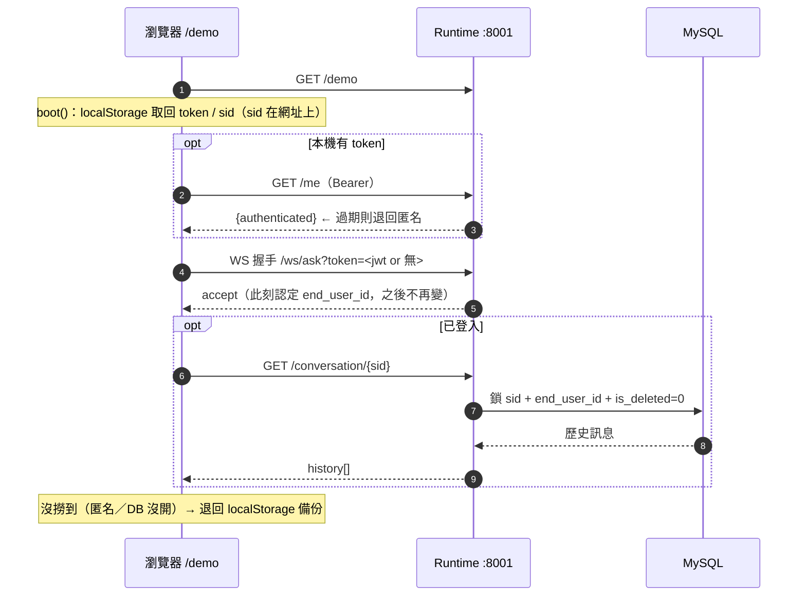
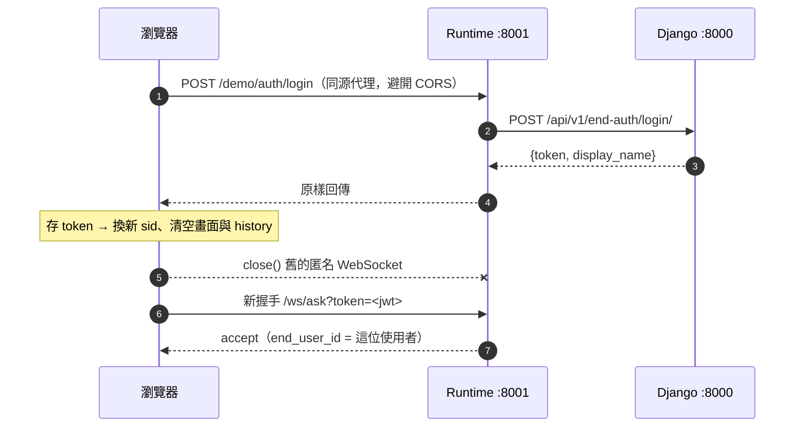
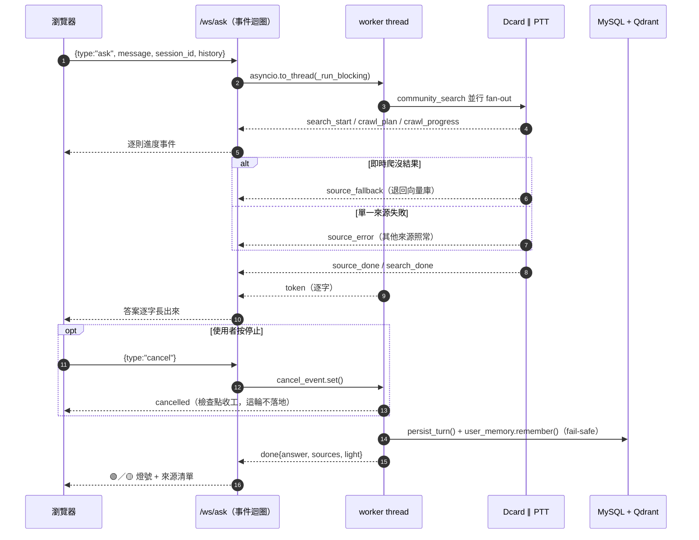
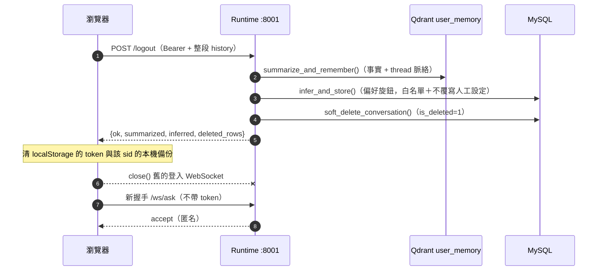

# SEIQA — 端到端時序圖

一次完整的使用者旅程：**開頁 → 登入 → 提問 → 登出**，四段串成一張。
重點在 ★ 標的三個時刻——**WebSocket 連線何時建立、何時被關掉重建**。

> 相關章節：`SEIQA專案解說.md` §1.4（旅程總覽）、§5（WebSocket）、§7（登出）；
> `docs/admin_backend_spec.md` §8.1（登入與 token）、§8.3（登出流程）。

---

## 1. 圖例

| 符號 | 意義 |
|------|------|
| `--->` | HTTP 請求／回應 |
| `===>` | WebSocket 訊息（握手後） |
| `---x` | 關閉 WebSocket |
| ★ | 連線生命週期的關鍵時刻 |

「Django+MySQL」這一欄同時代表 Admin 後台（`:8000`）與它的 MySQL（`crawl_agent`）；
爬蟲與 LLM 折進 Runtime 的自迴圈（實際上跑在 `asyncio.to_thread` 的 worker thread，見 §5.3）。

---

## 2. 完整時序圖（四段合一）

```
User       Browser(/demo)           Runtime :8001             Django+MySQL
  |               |                       |                         |
==(1) 開啟服務：開頁 boot ================================================
  |               |                       |                         |
  |  open /demo   |                       |                         |
  |-------------->|                       |                         |
  |               |  GET /demo            |                         |
  |               |---------------------->|                         |
  |               |  HTML (ws_demo.html)  |                         |
  |               |<----------------------|                         |
  |               |                       |                         |     從 localStorage 取回 token / sid
  |               |  GET /me  (Bearer)    |                         |
  |               |---------------------->|                         |
  |               |  authenticated?       |                         |
  |               |<----------------------|                         |     過期就誠實退回匿名
  |               |  WS /ws/ask?token=jwt |                         |
  |               |======================>|                         |  ★ 建立第 1 條 WebSocket
  |               |  accept               |                         |     握手時只讀一次 token，
  |               |<======================|                         |     這條連線的身分自此固定
  |               |  GET /conversation/id |                         |
  |               |---------------------->|                         |
  |               |                       |  SELECT sid+user+!del   |
  |               |                       |------------------------>|
  |               |                       |  rows                   |
  |               |                       |<------------------------|
  |               |  history[]            |                         |
  |               |<----------------------|                         |     匿名／DB 沒開 → 退回本機備份
  |               |                       |                         |
==(2) 登入（或註冊）=====================================================
  |               |                       |                         |
  |  login form   |                       |                         |
  |-------------->|                       |                         |
  |               | POST /demo/auth/login |                         |
  |               |---------------------->|                         |     同源代理，避開 CORS
  |               |                       |  POST end-auth/login/   |
  |               |                       |------------------------>|
  |               |                       |  JWT + display_name     |
  |               |                       |<------------------------|
  |               |  JWT                  |                         |
  |               |<----------------------|                         |     換新 sid、清空畫面與 history
  |               |  close (silent)       |                         |
  |               |----------------------x|                         |  ★ 關掉舊的「匿名」連線
  |               |  WS /ws/ask?token=jwt |                         |
  |               |======================>|                         |  ★ 用新身分重新握手
  |               |  accept (as user)     |                         |
  |               |<======================|                         |
  |               |                       |                         |
==(3) 提問（同一條連線可連問多輪）=======================================
  |               |                       |                         |
  | type question |                       |                         |
  |-------------->|                       |                         |
  |               | ask {message,history} |                         |
  |               |======================>|                         |
  |               |                       |--.                      |
  |               |                       |  |                      |     worker thread：
  |               |                       |<-'                      |     Dcard ∥ PTT 並行爬 → LLM
  |               |  stage / crawl_plan   |                         |
  |               |<======================|                         |  ┐
  |               |  crawl_progress ...   |                         |  │ 逐則事件即時推給前端
  |               |<======================|                         |  │ （左欄進度條就地更新）
  |               |  source_done/fallback |                         |  ┘
  |               |<======================|                         |
  |               |  token (delta)        |                         |
  |               |<======================|                         |     答案逐字長出來
  |  press Stop   |                       |                         |
  |-------------->|                       |                         |     （可選）中途取消
  |               |  cancel               |                         |
  |               |======================>|                         |     cancel_event.set()
  |               |                       |                         |     爬蟲在檢查點收工 → cancelled
  |               |                       |  persist_turn + remember|
  |               |                       |------------------------>|     這輪落地 + 長期記憶
  |               |  done{answer,sources} |                         |
  |               |<======================|                         |     🟢／🟡 燈號 + 來源清單
  |               |                       |                         |
==(4) 登出 ==============================================================
  |               |                       |                         |
  | click Logout  |                       |                         |
  |-------------->|                       |                         |
  |               | POST /logout (Bearer) |                         |
  |               |---------------------->|                         |     普通 HTTP，帶得了 header
  |               |                       |  summarize -> memory    |
  |               |                       |------------------------>|     整段對話 → 長期記憶
  |               |                       |  infer preferences      |
  |               |                       |------------------------>|     推論偏好旋鈕（白名單）
  |               |                       |  UPDATE is_deleted=1    |
  |               |                       |------------------------>|     軟刪這段原始紀錄
  |               |                       |  ok                     |
  |               |                       |<------------------------|
  |               |  {ok, deleted_rows}   |                         |
  |               |<----------------------|                         |     清 token + 該 sid 本機備份
  |               |  close (silent)       |                         |
  |               |----------------------x|                         |  ★ 關掉「登入中」的連線
  |               |  WS /ws/ask (no token)|                         |
  |               |======================>|                         |  ★ 重連成匿名
  |               |  accept (anonymous)   |                         |
  |               |<======================|                         |
  |               |                       |                         |
```

---

## 3. 為什麼登入／登出一定要重連？

因為**身分綁在連線上，不是綁在訊息上**：

1. 瀏覽器的 WebSocket API **不能帶自訂 header** → token 沒辦法像 `/ask` 那樣走
   `Authorization: Bearer`，只能塞進 query string（`/ws/ask?token=<jwt>`）。
2. 後端 `ws_ask()` 在 `accept()` 之後**只讀一次** query 的 token 決定 `end_user_id`
   （`app/api.py`），之後這條連線的身分就寫死了。

所以「換身分」在協定層面上等同「換連線」。前端三處都走同一個 `connect()`
（`app/static/ws_demo.html`），它的第一件事就是靜默關掉舊連線：

```js
if (ws) { ws.onclose = null; ws.close(); }   // onclose 設 null：不讓「連線已關閉」閃一下
```

| 觸發點 | 前端函式 | 新連線的身分 |
|--------|----------|--------------|
| 開頁 | `boot()` → `connect()` | localStorage 的 token（`/me` 驗過）或匿名 |
| 登入／註冊 | `submitAuth()` → `connect()` | 新 JWT（同時換 sid，匿名那段不歸戶） |
| 登出 | `logout()` → `connect()` | 匿名（不帶 token） |

配套：`setBusy()` 在問答進行中會鎖住登入／登出按鈕（中途重連會打斷生成中的那一輪）；
`ask()` 送出前若發現連線已斷，會自動 `connect()` 一次。

---

## 4. 分段 Mermaid（GitHub 可直接渲染／可匯出簡報用圖）

### 4.1 開頁 → 還原對話



### 4.2 登入（含重連）



### 4.3 提問（進度串流 + 中途取消）



### 4.4 登出（含重連）


